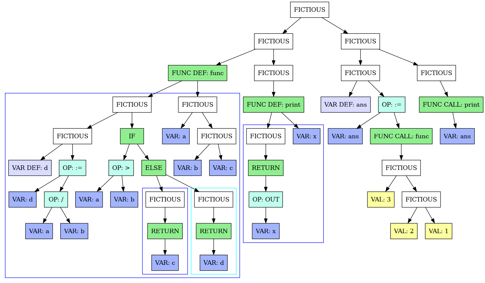

# Нативный компилятор ReverseLang под архитектуру x64

##  Описание

Компилятор — программа, переводящая написанный на языке программирования текст в бинарный исполняемый файл.
В конкретном случае — с ReverseLang в исполняемый ELF файл для архитектуры amd64. С синтаксисом ReverseLang можно ознакомится в 
[разделе с краткой справкой](#синтаксис-reverselang)

## Использование
### Сборка компилятора

Для сборки компилятора выполните команды:
```bash
$ git clone https://github.com/foxidokun/x64_compiler # Склонировать репозиторий
$ cd x64_compiler && make all                         # Собрать все необходимые бинарники
```

Теперь для сборки ReverseLang достаточно использовать скрипт `compile.sh`, передав ему два аргумента — файл с исходным кодом на языке Reverselang и путь, по которому сохранять собранный исполняемый файл.

Например, чтобы скомпилировать и запустить программу для решения квадратного уравнения, доступную в `examples/`:
```bash 
    $ ./compile.sh examples/quad.edoc /tmp/quad.bin
    $ /tmp/quad.bin  
        INPUT: 1     # x^2-4x+3 = 0
        INPUT: -4
        INPUT: 3
        OUTPUT: 2.00 # 2 roots
        OUTPUT: 1.00 # x = 1
        OUTPUT: 3.00 # x = 3
```

### Синтаксис ReverseLang

1. Все переменные имеют один тип — знаковые 64-битные числа.
2. Все функции обязательно имеют возвращаемое значение.
3. Стандартная библиотека языка содержит 3 функции: `input / output / sqrt`.
4. С переменными можно проводить следующие математические операции: `+, -, /, *`.
5. Доступны логические операции сравнения: `>, >=, <, <=`, а также логические И/ИЛИ (`&& и ||`) и отрицание (`!`).
6. В языке есть поддержка функций, циклов while и if-else блоков.

<details>
  <summary>Грамматика</summary>

```
Program        ::= PROG_BEG (SubProgram | Func)* PROG_END
Func           ::= L_BRACKET (NAME (SEP NAME)) R_BRACKET NAME FN FUNC_OPEN_BLOCK Subprogram FUNC_CLOSE_BLOCK
SubProgram     ::= (FlowBlock)+
FlowBlock      ::= IfBlock | WhileBlock | OPEN_BLOCK Body CLOSE_BLOCK | Body
WhileBlock     ::= L_BRACKET Expression R_BRACKET WHILE OPEN_BLOCK Body CLOSE_BLOCK
IfBlock        ::= L_BRACKET Expression R_BRACKET IF OPEN_BLOCK Body CLOSE_BLOCK (ELSE OPEN_BLOCK Body CLOSE_BLOCK)
Body           ::= (Line)+
Line           ::= BREAK Expression RETURN | BREAK Expression (= NAME (LET))
Expression     ::= OrOperand (|| OrOperand)+
OrOperand      ::= AndOperand (&& AndOperand)+
AndOperand     ::= CompOperand (<=> CompOperand)
CompOperand    ::= AddOperand  ([+-] AddOperand)*
AddOperand     ::= MulOperand  ([/ *] MulOperand )*
MulOperand     ::= GeneralOperand (NOT)
GeneralOperand ::= Quant | L_BRACKET Expression R_BRACKET
Quant          ::= VAR | VAL | INPUT | BuiltInFunc | L_BRACKET (Expression (SEM Expression)) R_BRACKET NAME
BuiltInFunc    ::= L_BRACKET Expression R_BRACKET (PRINT|SQRT|SIN)
```
</details>

Синтаксис ReverseLang является C-подобным с небольшим отличием: каждую строку стоит читать справа налево. Так, например,
следующий код на C
```c
int func (int a, int b, int c) {
    int d = a / b;
    
    if (a > b) {
        return c;
    } else {
        return d;
    }   
}
```
на ReverseLang примет следующий вид
```rust
(c, b, a) func fn
[
    ; b / a = d let
    (b > a) if
    {
        ; c return
    } else {
        ; d return
    }
]
```

Полную версию этого примера, как и остальные примеры, можно найти в директории `examples/`


*Сгенерированный по полной версии примера AST*

[//]: # (TODO Тут не хватает присваиваний, да и в целом описания синтаксиса чуть более подробного чем C-like)

## Принцип работы

### Архитектура компилятора

Компилятор разбит на три ключевых компонента, поэтапно обрабатывающих исходный код и использующих в качестве внутреннего представления абстрактное 
синтаксическое дерево (_abstract syntax tree_, AST). В синтаксическом дереве внутренние вершины сопоставлены с операторами языка программирования, а листья — с соответствующими операндами.

[//]: # (TODO Может выкинуть пояснение, что такое AST дерево? Все же шарят...) 

**Фронтенд**
1. Лексический анализ разбивает исходный код на логические кванты (лексемы) — числа, ключевые слова, имена переменных и функций.
2. Синтаксический анализ собирает из лексем синтаксические конструкции, такие как функции и циклы, используя алгоритм рекурсивного спуска ([описание алгоритма](https://en.wikipedia.org/wiki/Recursive_descent_parser)). 
3. В процессе рекурсивного спуска строится абстрактное синтаксическое дерево, которое и является итоговым результатом фронтенда.

**Промежуточный оптимизатор (middleend)**

Оптимизатор принимает на вход AST и пытается упростить его, не нарушая при этом логику работы программы. В данный момент из оптимизаций применяется только вычисление 
константных выражений: обнаружив конструкцию из математических или логических операций над числами, оптимизатор вычисляет ее и заменяет на результат. 

**Бэкенд** 

Бэкенд принимает на вход оптимизированное AST дерево и, обходя его в postorder порядке, генерирет машинный код для каждой вершины.
Таким образом при исполнении кода любой операции код вычисления ее операндов уже будет выполнен.

#### Обоснование архитектуры компилятора
Такая архитектура позволяет переиспользовать общие куски при адаптации компилятора под другие языки или под 
другие архитектуры. Так, например, компиляторы одного языка под `x64` и `arm` могут использовать общие
фронтенд и оптимизатор, а компиляторы двух разных языков под одну архитектуру могут переиспользовать оптимизатор и бэкенд.

В данном случае, поскольку фронтенды языков [ICPC](https://github.com/diht404/language) и [kaban54's lang](https://github.com/kaban54/language)
имеют совместимый формат AST, их можно скомпилировать с использованием бекенда ReverseLang.

Подобная архитектура не является чем-то новым и применяется в семействе компиляторов `GCC`, а также в основанных на `llvm` компиляторах, правда в последних в качестве 
внутреннего представления используется не AST, а линейное представление (LLVM IR).

### Устройство бекенда

Сам бекенд также имеет модульную структуру. Этап компиляции AST в машинный код разбит на три этапа: 
1. AST компилируется в линейное промежуточное представление (Backend IR) — массив структур, являющихся ассемблерным кодом
для абстрактного стекового процессора (подробнее далее в секции IR).
2. После получения IR можно начать выполнять оптимизационные проходы — убирать последовательные `push / pop`, например (_backend optimisations_). Однако в данный момент никакие оптимизации в бэкенде не применяются.
3. Далее этот IR транслируется в инструкции для конкретной архитектуры процессора.

При этом поскольку для разрешения адресов меток используется двухпроходная схема компиляции (_multi-pass compiler_), то этапы 1 и 3 выполняются два раза.

#### Обоснование архитектуры бэкенда
Бэкенд построен на тех же архитектурных принципах, что и компилятор в целом — разбиение на этапы для их переиспользования.
Backend IR позволяет объединить трансляцию AST в набор элементарных действий для процессорных архитектур схожего типа или для 
различных выходных форматов. Так, благодаря IR данный компилятор помимо компиляции в бинарный файл умеет работать в JIT режиме
с минимальным дублированием кода.

#### Backend IR

В данном компиляторе в качестве IR используется связный список структур
```c++
    struct instruction_t {
        instruction_type_t type;            // Тип инструкции — push / add / call / etc
        struct {                            // Какие аргументы требуются инструкции
            unsigned char need_imm_arg: 1;  // - Константа
            unsigned char need_reg_arg: 1;  // - Регистр
            unsigned char need_mem_arg: 1;  // - Извлекается ли аргумент из памяти
        };

        unsigned char reg_num;              // Номер регистра-аргумента (если используется)
        uint64_t imm_arg;                   // Константный аргумент (если используется)

        size_t index;                       // Номер инструкции в IR
        instruction_t *next;                // Указатель на следующую структуру
    };
```

При этом IR рассчитан на абстрактный стековый процессор, а потому имеет следующие инструкции:

| Команда            | Действие                                                                                                                                             |
|--------------------|------------------------------------------------------------------------------------------------------------------------------------------------------|
| `push imm/reg/mem` | Положить в стек константу, значение из регистра или из оперативной памяти по адресу `reg + imm`, где один из операндов (`reg` или `imm`) опционален. |
| `pop reg/mem`      | Извлечь из стека значение и положить его в регистр или оперативную память                                                                            |
| `add/sub/mul/div`  | Арифметические операции с двумя верхними элементами на стеке (верхний элемент стека является правым операндом)                                       |
| `sqrt / sin / cos` | Арифметические операции с один элементом на стеке                                                                                                    |
| `call/jmp/j?? imm` | Совершить переход на адрес (номер структуры в IR). `j??` обозначает условные переходы (`ja, jae, jb, jbe, je, jne`)                                  |
| `inp / out`        | Ввод / вывод верхнего элемента стека                                                                                                                 |
| `ret`              | Команда возврата из функции, обратная к call                                                                                                         |
| `halt`             | Завершение работы программы, аналог функции `abort()` в C                                                                                            |

При этом все инструкции поглощают свои операнды, если таковые имеются, и при наличии возвращаемого значения кладут его на верхушку стека. 

### Структура ELF файла


В результате компиляции создается исполняемый ELF файл, содержащий оттранслированный код и код стандартной библиотеки.

Для этого в исполняемый файл записывается следующая информация:

1. **Заголовок ELF файла** содержит общую информацию про бинарник: требуемую архитектуру процессора, адрес входа, количество и местоположение
сегментных заголовков. 

```c++
const Elf64_Ehdr ELF_HEADER = {
    .e_ident = {ELFMAG0, ELFMAG1, ELFMAG2, ELFMAG3, // Magic signature
                ELFCLASS64,                         // 64-bit system
                ELFDATA2LSB,                        // LittleEndian / BigEndian
                EV_CURRENT,                         // Version = Current
                ELFOSABI_NONE,                      // Non specified system
                0
                },
                
    .e_type    = ET_EXEC,                      // File type = Executable
    .e_machine = EM_X86_64,                    // Arch = amd64
    .e_version = EV_CURRENT,                   // Version = Current
    
    .e_entry   = 0x401000,                     // Fixed entry addr
    
    .e_phoff    = sizeof(Elf64_Ehdr),          // Offset of program header table. We took size of elf header
    .e_shoff    = 0,                           // Offset of segment header table. Not used => 0
    
    .e_flags    = 0,                           // Extra flags: no flags
    .e_ehsize   = sizeof(Elf64_Ehdr),	       // Size of this header.
    
    .e_phentsize = sizeof(Elf64_Phdr),         // Size of Program header table entry.
    .e_phnum     = NUM_PHEADERS,               // Number of pheader entries. (system + stdlib + code + ram)
    
    .e_shentsize = sizeof(Elf64_Shdr),         // Size of Segment header entry.
    .e_shnum     = 0,                          // Number of segments in programm.
    .e_shstrndx  = 0,                          // Index of string table. (Explained in further parts).
};

```

2. **Заголовки сегментов** содержат детальную информацию про каждый сегмент программы: права доступа, местоположение и размер в исполняемом файле, а также адрес, по которому его следует загружать.
Данный компилятор использует лишь 4 сегмента:

* **Служебный сегмент**
```c++
Elf64_Phdr SYSTEM_PHEADER = {
        .p_type   = PT_LOAD,
        .p_flags  = PF_R       , /* read */
        .p_offset = 0          , /* (bytes into file) */
        .p_vaddr  = 0x400000   , /* (virtual addr at runtime) */
        .p_paddr  = 0x400000   , /* (physical addr at runtime) */
        .p_filesz = sizeof(Elf64_Ehdr) + NUM_PHEADERS * sizeof(Elf64_Phdr), /* (bytes in file) */
        .p_memsz  = sizeof(Elf64_Ehdr) + NUM_PHEADERS * sizeof(Elf64_Phdr), /* (bytes in mem at runtime) */
        .p_align  = 4096       , /* (min mem alignment in bytes) */
};
```

Данный заголовок присутствует во всех исполняемых ELF файлах и загружает всю служебную информацию исполняемого файла по адресу `0x400000` с правами лишь на чтение.

* **Сегмент стандартной библиотеки**
```c++
Elf64_Phdr STDLIB_PHEADER = {
        .p_type   = PT_LOAD,
        .p_flags  = PF_R | PF_X,           /* Read & Execute */
        .p_offset = 4096,                  /* (bytes into file) */
        .p_vaddr  = 0x403000,              /* (virtual addr at runtime) */
        .p_paddr  = 0x403000,              /* (physical addr at runtime) */
        .p_filesz = x64::STDLIB_SIZE,      /* (bytes in file) */
        .p_memsz  = x64::STDLIB_SIZE,      /* (bytes in mem at runtime) */
        .p_align  = 4096,                  /* (min mem alignment in bytes) */
};
```

Для простоты генерации исполняемого файла стандартная библиотека загружается в собственный сегмент по адресу `0x403000`
с правами на исполнение. Поскольку код из исполняемого файла на самом деле не копируется, а лишь отображается в виртуальную память, то все сегменты обязаны
начинаться с адресов, кратных размеру страницы — 4096 байт. Поэтому стандартная библиотека вынужденно записывается в бинарник начиная с
4096 байта (`.p_offset`), а не сразу после сегментных заголовков.

* **Сегмент сгенерированного кода**

Сегмент сгенерированного кода отличается от стандартной библиотеки лишь адресом загрузки — `0x401000`, совпадающим 
с адресом входа из ELF заголовка (поле `.e_entry`). Таким образом после загрузки ELF файла в память начинает
исполняться именно этот сегмент.

* **Сегмент оперативной памяти**

Главное отличие сегмента оперативной памяти от остальных — он не занимает места на диске. Вместо этого при загрузке ELF файла
операционная система сама выделит область памяти заданного размера и заполнит ее нулями. Выражается это в нулевом поле
`.p_filesz`, отвечающим за размер сегмента в файле, и ненулевом `.p_memsz`, отвечающим за размер после загрузки.

```c++
const Elf64_Phdr BSS_PHEADER = {
        .p_type   = PT_LOAD,
        .p_flags  = PF_R | PF_W,
        .p_offset = 0,              /* (bytes into file) */
        .p_vaddr  = 0x404000,       /* (virtual addr at runtime) */
        .p_paddr  = 0x404000,       /* (physical addr at runtime) */
        .p_filesz = 0,              /* (bytes in file) */
        .p_memsz  = x64::RAMSIZE,   /* (bytes in mem at runtime) */
        .p_align  = 4096,           /* (min mem alignment in bytes) */
};
```

### Стандартная библиотека

В стандартной библиотеке ReverseLang реализованы следующие функции — ввод/вывод, извлечение квадратного корня и завершение программы (для инструкции halt).
Данные функции написаны на ассемблере с прямым использованием системных вызовов, чтобы избежать необходимости
линковки с glibc и последующего многократного усложнения структуры ELF файла. Исходный код stdlib находится в
`src/asm_stdlib/stdlib.nasm`.

Стандартная библиотека собирается в объектный файл для линковки с компилятором (где она используется в JIT режиме), а так же в исполняемый файл, для удобства последующей обработки.
При этом для ясности при запуске стандартной библиотеки как исполняемого файл, она выведет справочное сообщение и завершит свою работу.

Сборка стандартной библиотеки происходит автоматически с помощью make, однако это можно сделать и вручную:
```bash
    $ cd src/asm_strlib
    $ nasm -f elf64 stdlib.asm                        # Сборка объектного файла
    $ ld -e safety_entry -s -S stdlib.o -o stdlib.out # Сборка бинарного файла
```

Исполняемый файл используется при добавлении кода стандартной библиотеки в генерируемый бинарный файл. Компилятор загружает `stdlib.out`, анализирует его ELF заголовок и копирует содержащийся
там код в выходной файл. Однако компилятору для обращения к функциям библиотеки также необходимо знать их смещения, информация о которых нельзя получить простым путем анализа заголовков сегментов.
Поскольку в стандартной библиотеке мало функций и они практически никогда не меняются, было принято решение записать смещения функций как константы. 

Узнать их можно с помощью утилиты `readelf`, проанализировав с ее помощью объектный файл стандартной библиотеки:
```bash
    $ readelf -a stdlib.o
        ... 48 строк пропущено ...

Таблица символов «.symtab» содержит 16 элементов:
   Чис:    Знач           Разм Тип     Связ   Vis      Индекс имени
     0: 0000000000000000     0 NOTYPE  LOCAL  DEFAULT  UND 
     1: 0000000000000000     0 FILE    LOCAL  DEFAULT  ABS stdlib.nasm
     2: 0000000000000000     0 SECTION LOCAL  DEFAULT    1 .text
     3: 000000000000004f     0 NOTYPE  LOCAL  DEFAULT    1 input_asm.L6
     4: 0000000000000059     0 NOTYPE  LOCAL  DEFAULT    1 input_asm.L4
     5: 0000000000000081     0 NOTYPE  LOCAL  DEFAULT    1 input_asm.L19
     6: 0000000000000092     0 NOTYPE  LOCAL  DEFAULT    1 input_asm.L18
     7: 00000000000000a6     0 NOTYPE  LOCAL  DEFAULT    1 input_asm.L16
     8: 0000000000000175     0 NOTYPE  LOCAL  DEFAULT    1 output_asm.L28
     9: 00000000000001a6     0 NOTYPE  LOCAL  DEFAULT    1 output_asm.L27
    10: 00000000000001bf     0 NOTYPE  LOCAL  DEFAULT    1 output_asm.L29
    11: 00000000000001e3     0 NOTYPE  LOCAL  DEFAULT    1 output_asm.L30
    12: 0000000000000000     0 NOTYPE  GLOBAL DEFAULT    1 input_asm
    13: 00000000000000ad     0 NOTYPE  GLOBAL DEFAULT    1 output_asm
    14: 00000000000001ef     0 NOTYPE  GLOBAL DEFAULT    1 exit_asm
    15: 00000000000001fb     0 NOTYPE  GLOBAL DEFAULT    1 sqrt_asm
```
 
Как видно из вывода этой программы, код `input_asm` находится в самом начале, `output_asm` начинается со смещения `0xAD` и так далее.

### Сравнение времени работы

Поскольку в предыдущем семестре был написан компилятор ReverseLang для эмулятора стекового процессора (репозитории [компилятора](https://github.com/foxidokun/ReverseLang) и [эмулятора](https://github.com/foxidokun/cpu)), то можно сравнить производительность нативного x64 кода с эмулятором стекового процессора.
Для сравнения измерим время работы двух программ: решение квадратного уравнения $2x² + 2x - 12 = 0$ и расчет 15го числа Фибоначчи, код которых расположен в `examples/`. 

**Методика измерений**

В каждой программе соответствующий алгоритм запускается 10000 раз, то есть квадратное уравнение решается 10000 раз за запуск. При этом для каждой программы проводится
пять запусков, результаты которых в последствии усредняются и считается погрешность.

<details>
  <summary>**Информация о тестовом стенде**</summary>

```
    OS: Arch Linux (22.05.2023)
    Kernel: 6.3.1
    CPU: Ryzen 4800H
    CPU Governor: perfomance (max frequency) 
    
    Никаких программ, кроме тестируемой, не запущено, тестируемой программе выдан максимальный приоритет (уровень nice выставлен в -20).
```

</details>


Результаты:

| Программа            | x64             | stack cpu        | Ускорение       |
|----------------------|-----------------|------------------|-----------------|
| Квадратное уравнение | `9.3  ± 0.2 ms` | `50.6  ± 0.5 ms` | `5.44 ± 0.03`   |
| Число Фибоначчи      | `68.2 ± 0.7 ms` | `403.1 ± 0.9 ms` | `5.910 ± 0.012` |


Как видно из таблицы, использование нативной архитектуры значительно обгоняет запуск на эмуляторе.